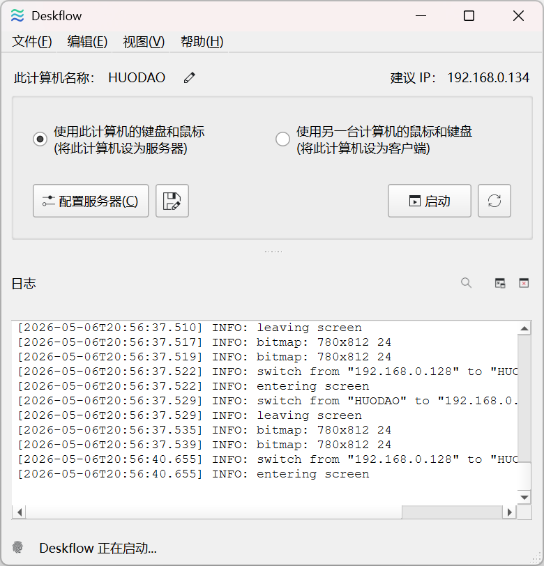
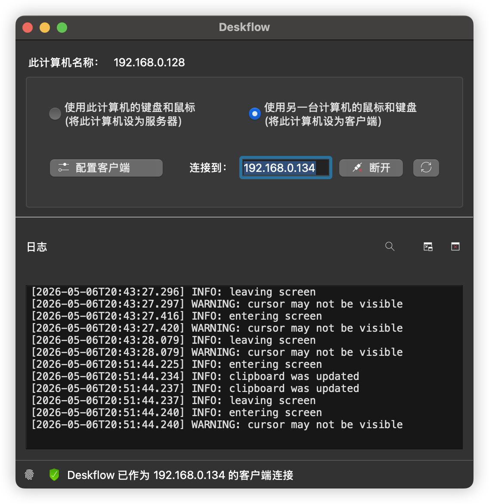
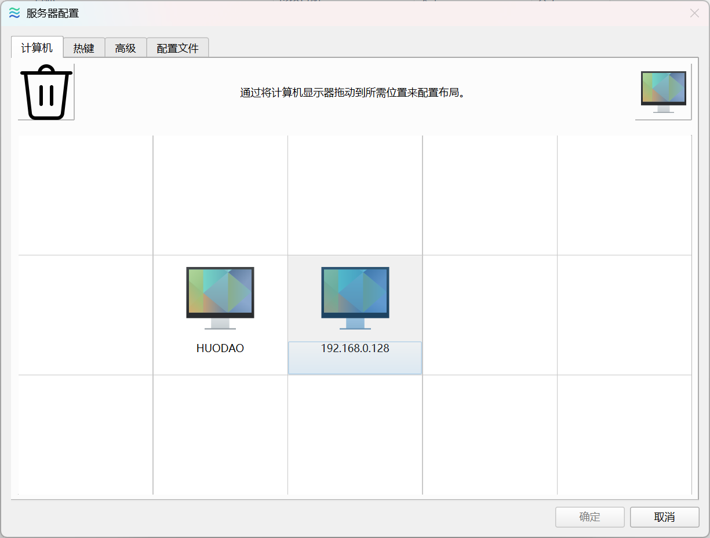

# 双端键鼠的解决方案-Deskflow

## 软件介绍
Deskflow是一款开源软件，能够在两台电脑上使用同一套键鼠，而不是两套键鼠切来切去，完美符合我这种非罗技用户的mac/Windows双电脑多屏幕用户。虽然罗技的方案很棒，但是还是要花钱买一套设备不是吗，于是在我折腾了一圈后，选择了Deskflow

## 软件安装
- github上直接下载对应的软件包，Windows的x64.msi版本,macOs则根据电脑芯片选择对应的arm64/x86_64的dmg
- 如果Windows安装提示C++ Redistribute缺失，则需要下载额外的c++运行库，https://aka.ms/vc14/vc_redist.x64.exe，一般直接下载这个安装就好了
- macOs需要允许应用获取权限

## 软件配置
虽然是全英文，但是配置起来也很简单，只需要点击启动，就能开启服务

在客户端填入服务端ip，点击连接，在防火墙没有问题的情况下，一般就能连接成功了

点击服务端的配置服务器，就可以调整两台设备的相对位置，根据你摆放的位置，来调整即可

## 问题
- 目前有一个问题，切到mac上用Windows键盘按win+l（即cmd+l），会触发Windows的锁屏，目前只能通过禁用Windows的快捷键来规避，当然也可能是我使用方法有问题。